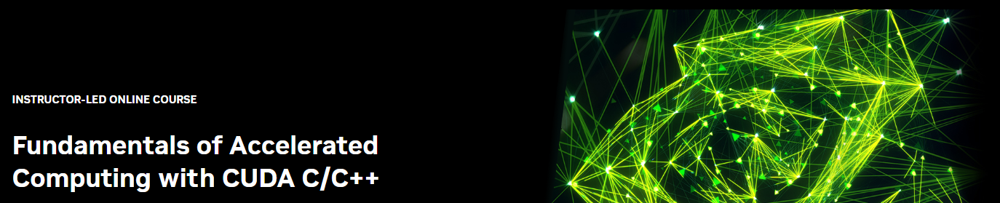

## Table of Contents
1. [Description](#description)
2. [Certificate](#certificate)

## Description

The CUDA computing platform enables the acceleration of CPU-only applications to run on the world’s fastest massively parallel GPUs. Experience C/C++ application acceleration by:

- Accelerating CPU-only applications to run their latent parallelism on GPUs
- Utilizing essential CUDA memory management techniques to optimize accelerated applications
- Exposing accelerated application potential for concurrency and exploiting it with CUDA streams
- Leveraging the command line and visual profiling to guide and check your work

Upon completion, you’ll be able to accelerate and optimize existing C/C++ CPU-only applications using the most essential CUDA tools and techniques. You’ll understand an iterative style of CUDA development that will allow you to ship accelerated applications fast.

## Certificate

The certificates for the workshops can be found below:

["Fundamentals of Accelerated Computing with CUDA C/C++" - NVIDIA Deep Learning Institute](https://courses.nvidia.com/certificates/d7e6b079cc1d448287de4d88f9b42a06/) (Issued On: November 2023)
["Deep Learning and GPU programming workshop" - LRZ: Leibniz Supercomputing Centre](https://github.com/HROlive/Fundamentals-of-Accelerated-Computing-with-CUDA-C-Cpp/blob/main/images/certificate.pdf) (Issued On: November 2023)
